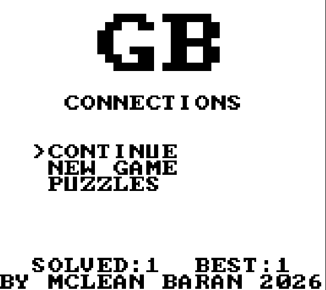
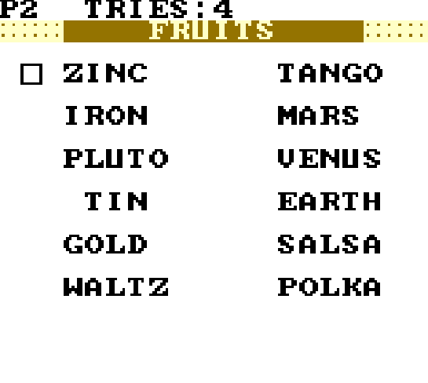
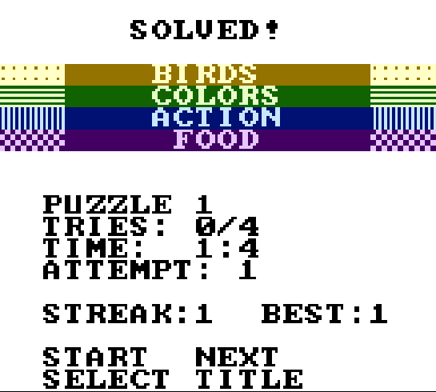

# Game Boy Connections

A homebrew Game Boy ROM that recreates the [NYT Connections](https://www.nytimes.com/games/connections) puzzle game. 50 puzzles, 4 difficulty tiers per puzzle, full save support, replay any completed puzzle, per-puzzle best-time records, multi-voice title chiptune with drums, and tiered milestone celebrations.

Plays on original Game Boy (DMG) in monochrome. On Game Boy Color (GBC) — same ROM, no need to download anything different — the four tier bars render in their faithful NYT yellow/green/blue/purple.

## Screenshots

| Title | Gameplay | Win |
|---|---|---|
|  |  |  |

## Play it

1. **Download the ROM** from the [latest release page](https://github.com/baranmcl/gameboygame/releases/latest) — the `gameboygame.gb` asset.

2. **Get a Game Boy emulator.** Any DMG-compatible emulator will work. Recommended:
   - **[mGBA](https://mgba.io/downloads.html)** — cross-platform, accurate, free. The ROM was developed and tested against mGBA.
   - **[BGB](https://bgb.bircd.org/)** — Windows-only, the gold standard for Game Boy accuracy and debugging.
   - **[SameBoy](https://sameboy.github.io/)** — macOS/Windows/Linux, also extremely accurate.

3. **Load the ROM.** In your emulator, open `gameboygame.gb` (File → Open ROM, or drag-and-drop).

## How to play

Each puzzle has **16 words** arranged in a 4×8 grid. They belong to **4 hidden categories** of 4 words each (yellow = easiest, purple = hardest). Your job is to figure out which words go together and submit each group of 4.

You get **4 tries**. Solve all 4 groups → you win. Run out of tries → you see the answers.

### Controls

| Button   | Action                                          |
|----------|-------------------------------------------------|
| **D-pad**| Move the cursor between word cells              |
| **A**    | Select / deselect the highlighted word          |
| **B**    | Clear all current selections                    |
| **START**| Submit your selection (must have exactly 4)     |
| **SELECT**| Quit to title screen (asks for confirmation)   |

### Tips

- The game **saves your progress automatically** after every action. Close the emulator mid-puzzle and your next session will resume right where you left off.
- The 4 colored bars at the top of solved categories show their **difficulty tier**: yellow (easiest) → green → blue → purple (hardest).
- After a puzzle ends, **START** moves to the next puzzle and **SELECT** returns to the title.
- Lifetime stats (puzzles solved, current streak, best streak) are visible on the title screen.

## Build from source

Requires [GBDK-2020](https://github.com/gbdk-2020/gbdk-2020) (SDCC-based Game Boy compiler) and Python 3 for the build pipeline.

```bash
make          # build the ROM at build/gameboygame.gb
make test     # run the host-side test suite (60 tests across puzzle logic, layout, codegen)
make clean    # remove build artifacts
```

Puzzle content lives in `content/puzzles.json` and is validated + compiled into `src/puzzles_data.c` at build time by `tools/build_puzzles.py`.

## Project status

**v1.2 shipped 2026-05-26.** Adds puzzle-select replay screen + per-puzzle best records, tiered milestone celebrations (every 5 lifetime solves + every 5-puzzle streak + all-puzzles-done), multi-voice title music with kick/snare drum beat, puzzle-start CH1 fanfare, ALL_DONE scene with 2-voice fanfare + scrolling text, cascade-bar slide-in animations, and 20 more puzzles (50 total). Save data from v1.0/v1.1 carries over automatically. Same ROM works on DMG and GBC. Hardware verification on real Game Boy hardware via flash cart is deferred to a future release.
